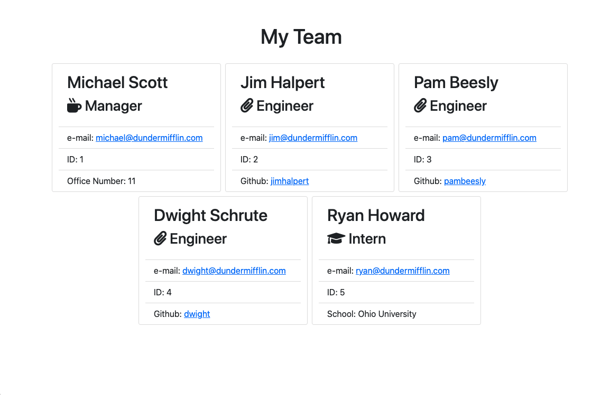

# team-profile-generator
Coding Bootcamp Weekly Challenge 10. This application generates an HTML webpage with contact information about employees on a software engineering team. This application is built using Node.js and runs on the terminal command line.

## About This Repository
This repository contains the working files for the Coding Bootcamp Weekly Challenge 10.  
The objective of this exercise is to apply the concepts learned during the module Object Oriented Programming. The application runs on Node.js and presents the user a series of questions about their team members. The app will output an HTML page with the information gathered about the employees and links to their e-mails and github profiles.

## Example file
Please check the HTML file in the dist folder.

## Usage
Please check this [walk-through video](https://drive.google.com/file/d/1dpovwHS9I5fWbOk89RRicIvJmUGserhY/view) for a demonstration of its use.

## Built With
* Node.js
* Inquirer

## Support
If you find any bugs or have any questions, please contact me on Github.

## Authors and Acknowledgment
Code built by Leandro Michelena, based on content provided by Trilogy Education Services, a 2U, Inc. brand.  

## License
MIT License
